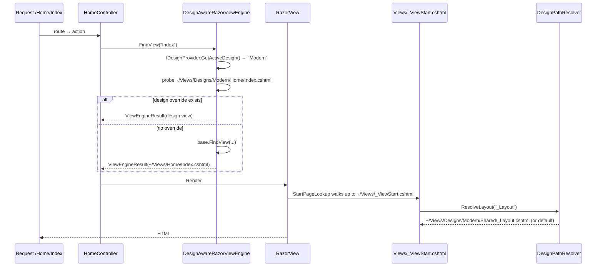
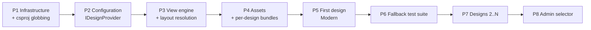

# Multi-Design Razor View Architecture — Implementation Plan

**Project:** EImece (ASP.NET MVC 5.3 / .NET Framework 4.8.1 e-commerce application)
**Goal:** Support multiple interchangeable Razor UI designs in one repository, with theme-first view resolution and fallback to the existing design.
**Status:** Planning only. No implementation code has been written; no existing files were modified.

---

## 0. Executive summary

**Recommendation: yes, use a custom Razor view engine — but a custom view engine alone will not work for this codebase, and it is not the hard part.**

ASP.NET MVC 5 resolves *views and partials* through `IViewEngine`, but resolves *layouts* through a completely different subsystem (WebPages' `VirtualPathFactoryManager` / `BuildManager`). This project sets `Layout` to a hard-coded absolute path in **83 view files**, which no view engine can intercept. So the architecture needs two cooperating mechanisms:

| Concern | Mechanism |
|---|---|
| Views, partials, display/editor templates | `DesignAwareRazorViewEngine : RazorViewEngine` overriding `FindView` / `FindPartialView` |
| Layouts (`Layout = "..."`) | A design-aware `_ViewStart.cshtml` + a small path-resolver helper |
| Static assets | Per-design bundles registered at startup, selected per request |

I explicitly recommend **against** a `VirtualPathProvider`, and I recommend putting design views **inside** `Views/` rather than in a top-level `Themes/` folder. Both recommendations are driven by specific facts in this codebase, explained below.

I also recommend calling the concept **"Design"** rather than **"Theme"**, because this codebase already uses "theme" for four unrelated things (see §1.7).

---

## 1. Current architecture analysis

### 1.1 Platform versions (do not change)

| Component | Version | Source |
|---|---|---|
| .NET Framework | **4.8.1** | `EImece.csproj:19` (`<TargetFrameworkVersion>v4.8.1</TargetFrameworkVersion>`) |
| ASP.NET MVC | **5.3.0** | `Microsoft.AspNet.Mvc.5.3.0`, `EImece.csproj:345` |
| Razor | **3.3.0** | `Microsoft.AspNet.Razor.3.3.0`, `EImece.csproj:348` |
| WebPages | **3.3.0** | `Microsoft.AspNet.WebPages.3.3.0`, `EImece.csproj:351` |
| DI container | Microsoft.Extensions.DependencyInjection 10.0.10 | `packages.config`, `App_Start/DependencyInjectionConfig.cs` |

### 1.2 How views are resolved today

There is **no customization whatsoever**. A repo-wide search for `ViewEngines.Engines.Add`, `ViewLocationFormats`, `PartialViewLocationFormats`, `AreaViewLocationFormats`, `VirtualPathProvider`, `IViewPageActivator`, and `ControllerBuilder.SetControllerFactory` returns nothing. The application runs on the stock `ViewEngines.Engines` collection (`RazorViewEngine` + `WebFormViewEngine`) with default location formats.

The only reference to the engine collection is a consumer, not a configurator:

```csharp
// EImece.Domain/Helpers/PartialViewToString.cs:19
ViewEngineResult result = ViewEngines.Engines.FindPartialView(controllerContext, partialViewName);
```

This is good news: there is no existing convention to fight, and adding an engine at position 0 is a purely additive change.

`Application_Start` registers in this order — note there is currently no view-engine step, and one would need to be inserted before `AreaRegistration.RegisterAllAreas()`:

```csharp
// EImece/Global.asax.cs:29-42
protected void Application_Start()
{
    ConnectionStringProvider.Initialize();
    DependencyInjectionConfig.Register();
    System.Net.ServicePointManager.SecurityProtocol = SecurityProtocolType.Tls12;

    AreaRegistration.RegisterAllAreas();
    FilterConfig.RegisterGlobalFilters(GlobalFilters.Filters);
    RouteConfig.RegisterRoutes(RouteTable.Routes);
    BundleConfig.RegisterBundles(BundleTable.Bundles);
    // ...
}
```

### 1.3 How layouts are resolved today — the critical finding

There are exactly **three** `_ViewStart.cshtml` files and **three** `_Layout.cshtml` files:

| `_ViewStart` | Layout it sets |
|---|---|
| `Views/_ViewStart.cshtml` | `~/Views/Shared/_Layout.cshtml` |
| `Areas/Admin/Views/_ViewStart.cshtml` | `~/Areas/Admin/Views/Shared/_Layout.cshtml` |
| `Areas/Customers/Views/_ViewStart.cshtml` | `~/Areas/Customers/Views/Shared/_Layout.cshtml` |

None contain conditional logic:

```razor
@* Views/_ViewStart.cshtml *@
@{
    Layout = "~/Views/Shared/_Layout.cshtml";
}
```

**But 83 individual views redundantly re-declare the same absolute layout path**, duplicating what `_ViewStart` already does — 12 in root `Views/`, 4 in the Customers area, and 67 in the Admin area. For example `Views/Products/Detail.cshtml:30`, `Views/Stories/Detail.cshtml:13`, `Views/Payment/BuyNow.cshtml:25`.

This matters enormously. In Razor / WebPages, `Layout` is a virtual path resolved by `WebPageBase` through `VirtualPathFactoryManager` and `BuildManager` — **not** through `IViewEngine`. A custom view engine has no ability to intercept it. As long as those 83 lines exist, no view engine on earth can give those pages a different layout.

The good news: because those 83 assignments are *byte-identical* to what the corresponding `_ViewStart` already sets, deleting them is a provably behavior-preserving change. That makes design-aware layouts a one-file change plus a mechanical deletion.

Two views legitimately opt out of layouts and must be left alone: `Views/Account/AdminLogin.cshtml:8` and `Views/UnderConstruction/Index.cshtml:2`, both `Layout = null`.

### 1.4 Views and Areas inventory

279 `.cshtml` files total:

| Location | Count |
|---|---|
| `Views/` (public site) | 124 |
| `Areas/Admin/Views/` | 144 |
| `Areas/Customers/Views/` | 11 |

Two areas exist, both registered conventionally (`Areas/Admin/AdminAreaRegistration.cs`, `Areas/Customers/CustomersAreaRegistration.cs`). The admin panel is a genuine MVC Area at `/Admin/{controller}/{action}`, with 33 controllers mostly deriving from `BaseAdminController`. Admin login is *outside* the area, at `Views/Account/AdminLogin.cshtml` with `Layout = null`.

`Views/Shared/` holds 69 files: 30 partials at the root (`_Layout`, `_Footer`, `_Navigation`, `_WebSiteLogo`, `_SearchProductForm`, …), 18 `DisplayTemplates`, 1 `EditorTemplates`, 8 `PageThemes`, 6 `ShoppingCartTemplates`, 6 `StoriesPageThemes`.

### 1.5 Hard-coded presentation paths that bypass view resolution

This is the concrete migration checklist. There are three categories.

**(a) `~/Views/...` passed to `RenderPartialToString` from C# — 8 sites.** These reach `VirtualPathProviderViewEngine.GetPathFromSpecificName`, which skips location formats entirely:

| File:line | Path |
|---|---|
| `Controllers/AjaxController.cs:33` | `~\Views\Shared\ShoppingCartTemplates\_HomePageShoppingCart.cshtml` |
| `Controllers/PaymentController.cs:187` | `~\Views\Shared\ShoppingCartTemplates\_ShoppingCartSmallDetails.cshtml` |
| `Controllers/PaymentController.cs:199` | `~\Views\Shared\ShoppingCartTemplates\_ShoppingCartLinks.cshtml` |
| `Controllers/PaymentController.cs:449` | `~\Views\Shared\CargoTrackingResult.cshtml` |
| `Areas/Admin/Controllers/AjaxController.cs:652,673` | `~/Areas/Admin/Views/Shared/pSelectedTags.cshtml` |
| `Areas/Admin/Controllers/AjaxController.cs:684` | `~/Areas/Admin/Views/Shared/pProductDetailToolTip.cshtml` |
| `Areas/Admin/Controllers/AjaxController.cs:695` | `~/Areas/Admin/Views/Shared/pImagesTag.cshtml` |

Note the backslash form in the root controllers. Each converts trivially to a relative name (`"ShoppingCartTemplates/_HomePageShoppingCart"`), which then flows through location formats and becomes design-overridable for free.

**(b) `@Html.Partial("~/Views/...")` in Razor — 5 sites**, all identical, at line 2 of `Views/Shared/StoriesPageThemes/PageTheme_T1..T5.cshtml`, referencing `_StoryCategoryBootstrap.cshtml`. Same fix.

**(c) A filesystem existence probe** in `Views/Stories/Categories.cshtml:18`:

```razor
var selectedPagePath = "StoriesPageThemes/PageTheme_" + category.PageTheme;
var themePhysicalPath = HostingEnvironment.MapPath("~/Views/Shared/" + selectedPagePath + ".cshtml");
```

This will report "not found" for a partial supplied only by a design, so it must become design-aware.

Also worth noting: `Controllers/HomeController.cs:243,254` uses relative cross-folder view names (`View("../Products/Detail", product)`, `View("../Pages/Detail", page)`). These resolve as specific-ish paths through the engine and need explicit test coverage under a design.

### 1.6 Assets and bundling

`App_Start/BundleConfig.cs` registers 15 bundles with `BundleTable.EnableOptimizations = true` hard-coded (line 10). Bundle URLs therefore carry content hashes, which gives cache-busting for free.

The current storefront design is a vendor theme ("mstore" / Cartzilla) living in `Content/mstore/` (283 files: `css/`, `js/`, `fonts/`, `img/`, plus 10 color skins). The public layout renders exactly three bundles:

```razor
@* Views/Shared/_Layout.cshtml:74 *@
@Styles.Render("~/Content/eimeceTheme")

@* Views/Shared/_Layout.cshtml:186-187 *@
@Scripts.Render("~/bundles/mstore")
@Scripts.Render("~/bundles/eimeceScripts")
```

That is a very favorable starting point: the entire public design's CSS/JS is behind three bundle names in one file. Swapping designs is largely a matter of swapping those three names.

Roughly 64 hard-coded asset references exist across ~24 `.cshtml` files (`~/Content/mstore/img/flags/...` in `_SocialMediaLinks.cshtml:62`, `url(/Content/img/hero-main-bg.jpg)` in `Views/Home/Index.cshtml:54`, `~/Content/img/logo-footer-mastervisa.png` in `_Footer.cshtml:94`, and so on). These are the ones that need to become design-relative.

Three asset categories must stay **outside** the design system because they are content, not presentation:

- `media/` — user uploads (`Constants.cs:100-102`: `TempPath`, `ServerMapPath`, `UrlBase`)
- The `/images/{size}/{id}` resize proxy served by `ImagesController` and routed in `RouteConfig.cs:48-74`
- `/images/logo.jpg`, referenced from `Constants.cs:19`, `MailTemplateService.cs:67,97`, and email templates

The Customers area layout bypasses bundling entirely and hard-codes `~/Content/mstore/...` `<link>` / `<script>` tags at `Areas/Customers/Views/Shared/_Layout.cshtml:27-29,57-59`. That inconsistency needs cleaning up if the Customers area is ever designed.

There is **no CSP header** (`SecurityHeadersHttpModule.cs` sets only `X-Frame-Options`), so designs can freely introduce new asset origins without a security-header change.

### 1.7 Naming: "theme" is already taken, four times over

Before writing any code, settle vocabulary. In this codebase "theme" already means:

1. **Per-page content template** — `Menu.PageTheme` and `StoryCategory.PageTheme` are `string` columns holding `"T1"`…`"T8"` (`Entities/Menu.cs:29`, `Entities/StoryCategory.cs:17`, constants at `Constants.cs:110-117`), dispatched to `Views/Shared/PageThemes/PageTheme_T{n}.cshtml`. The admin even validates it (`StoryCategoriesController.cs:61-63`).
2. **jQuery UI base theme** — `Content/themes/base/` and the `~/Content/themes/base/css` bundle.
3. **The vendor storefront theme** — `Content/mstore/css/theme.min.css`, `Content/mstore/css/skins/`.
4. **The current bundle name** — `~/Content/eimeceTheme`.

Adding a fifth meaning will cause real confusion in settings keys, folder names, and code review. I recommend **"Design"** throughout: `IDesignProvider`, `ActiveDesign`, `Views/Designs/`, `Content/designs/`. It also matches the business vocabulary ("Design 1 – Classic"). If "Theme" is preferred for external-facing labels, keep it in the display metadata only, not in code or paths.

Incidentally, the existing `PageTheme` mechanism is a useful precedent worth preserving rather than replacing: it already demonstrates runtime template selection with a fallback, and designs should be able to override `PageTheme_T*.cshtml` files just like any other partial.

### 1.8 Two operational constraints that shape everything

**Output caching is used aggressively and will serve stale HTML across a design switch.** 20+ actions carry `[CustomOutputCache]`. Critically, several profiles have **no** `varyByCustom`:

```xml
<!-- Web.config:154-159 -->
<add name="Cache1Hour"  duration="3600"    varyByParam="*" location="Any" />
<add name="Cache10Days" duration="864000"  varyByParam="*" location="Any" />
<add name="Cache30Days" duration="2592000" varyByParam="*" location="Any" />
<add name="ImageProxyCaching" duration="6000" varyByParam="*" location="Client" />
```

`Cache1Hour` is what the homepage uses (`HomeController.cs:63`). `location="Any"` means downstream / proxy caching too. Without a fix, switching designs leaves the homepage showing the old design for up to an hour, and `Cache30Days` pages effectively forever. There is already a hook to extend — `GetVaryByCustomString` at `Global.asax.cs:70-94`, currently handling only `"User"`.

**The project is old-style MSBuild with 276 explicit `<Content Include>` entries for `.cshtml` and zero wildcards.** A search for `Include="...*"` in `EImece.csproj` returns nothing. Example:

```xml
<!-- EImece.csproj:902-906 -->
<Content Include="Areas\Admin\Views\_ViewStart.cshtml" />
<Content Include="Areas\Admin\Views\Shared\_Layout.cshtml" />
<Content Include="Areas\Admin\Views\Shared\_AdminHelpAccordionStart.cshtml" />
```

With 10 designs this becomes a serious operational hazard: a `.cshtml` that exists on disk but is missing from the csproj builds fine locally and 404s / 500s only after publish. `MvcBuildViews` is `false` (`EImece.csproj:20`), so nothing catches it at build time either. This must be addressed in Phase 1, not later.

---

## 2. Recommended design architecture

### 2.1 Directory structure

```
EImece/EImece/
│
├── Views/                                  ← UNTOUCHED default design (the fallback)
│   ├── _ViewStart.cshtml                   ← MODIFIED once: design-aware layout resolution
│   ├── Home/  Products/  Stories/  Payment/  ...
│   ├── Shared/
│   │   ├── _Layout.cshtml  _Header.cshtml  _Footer.cshtml  _Navigation.cshtml
│   │   ├── DisplayTemplates/  EditorTemplates/
│   │   └── PageThemes/  StoriesPageThemes/  ShoppingCartTemplates/
│   │
│   └── Designs/                            ← NEW: all design view overrides
│       ├── Modern/
│       │   ├── design.json                 ← metadata (name, label, version, assets)
│       │   ├── Home/Index.cshtml           ← overrides ~/Views/Home/Index.cshtml
│       │   ├── Shared/_Layout.cshtml       ← overrides ~/Views/Shared/_Layout.cshtml
│       │   ├── Shared/_Footer.cshtml
│       │   └── Areas/Customers/            ← optional, area-scoped overrides
│       │       ├── _ViewStart.cshtml
│       │       └── Home/Index.cshtml
│       ├── Minimal/
│       ├── Corporate/
│       └── Ecommerce/
│
├── Content/
│   ├── mstore/  themes/base/  img/  ...    ← UNTOUCHED (default design assets)
│   └── designs/                            ← NEW: all design static assets
│       ├── modern/
│       │   ├── css/theme.css
│       │   ├── js/design.js
│       │   ├── img/
│       │   └── fonts/
│       ├── minimal/
│       └── corporate/
│
├── App_Start/
│   ├── ViewEngineConfig.cs                 ← NEW
│   ├── DesignConfig.cs                     ← NEW (design registry + bundle registration)
│   └── BundleConfig.cs                     ← MODIFIED: default bundles renamed conceptually
│
└── Infrastructure/Designs/                 ← NEW
    ├── DesignAwareRazorViewEngine.cs
    ├── IDesignProvider.cs
    ├── ConfigDesignProvider.cs
    ├── DesignContext.cs
    ├── DesignPathResolver.cs
    └── DesignHtmlHelpers.cs
```

### 2.2 Why views go under `Views/Designs/` and not a top-level `Themes/`

The proposed top-level `Themes/Design1/Views/...` is intuitive, but in ASP.NET MVC 5 it costs you four things for free that `Views/Designs/` gives you automatically. This is not a style preference; each point is a concrete mechanism.

**(1) `_ViewStart` inheritance.** `_ViewStart.cshtml` is **not** resolved by the view engine. `RazorView.RenderView` calls `StartPageLookup`, which walks up the directory chain from the view's own virtual path to the application root, executing outermost-first.

- `~/Views/Designs/Modern/Home/Index.cshtml` walks `…/Home` → `…/Modern` → `Views/Designs` → `Views` → **finds `~/Views/_ViewStart.cshtml`**. ✅
- `~/Themes/Design1/Views/Home/Index.cshtml` walks `…/Home` → `…/Views` → `…/Design1` → `Themes` → app root. It **never sees `~/Views/_ViewStart.cshtml`**. ❌

With a top-level folder, every one of 10 designs needs its own `_ViewStart.cshtml` maintained in lockstep. With `Views/Designs/`, one file governs all of them.

**(2) Razor host configuration.** `Views/Web.config` declares the `system.web.webPages.razor` section group, the `MvcWebRazorHostFactory`, `pageBaseType="System.Web.Mvc.WebViewPage"`, and the namespace imports (`System.Web.Mvc`, `System.Web.Optimization`, `EImece`, `EImece.Domain.Helpers.HtmlHelpers`). ASP.NET config inheritance is per-directory, so `Views/Designs/**` inherits all of it. A top-level `Themes/` folder needs a duplicate of that file, per design, or a carefully `<location>`-scoped one.

**(3) Source-code protection.** `Views/Web.config` blocks direct HTTP access to `.cshtml` sources:

```xml
<!-- Views/Web.config:30-35 -->
<system.webServer>
  <handlers>
    <remove name="BlockViewHandler" />
    <add name="BlockViewHandler" path="*" verb="*" preCondition="integratedMode" type="System.Web.HttpNotFoundHandler" />
  </handlers>
</system.webServer>
```

A top-level `Themes/` folder without this would serve raw Razor source over HTTP — a real information-disclosure bug.

**(4) The same `BlockViewHandler` is exactly why assets must NOT live under `Views/`.** Note `path="*"` — it 404s *every* file type, not just `.cshtml`. Putting `Themes/Design1/Content/style.css` under `Views/` would return 404. This is the single reason the recommended structure splits views (`Views/Designs/`) from assets (`Content/designs/`), rather than co-locating them as originally proposed.

`Content/designs/` in turn inherits `Content/Web.config`'s 365-day static-cache policy, and keeps every asset URL in the shape the codebase already uses (`~/Content/...`). Use lowercase `designs` and lowercase design folder names to avoid the case-sensitivity foot-gun already present in the repo (`BundleConfig.cs:33` references `~/Content/site.css` while the file on disk is `Site.css` — harmless on IIS, a break on a case-sensitive filesystem).

One caveat to accept knowingly: `Views/Designs/` would collide with a future `DesignsController`, because the default location format `~/Views/{controller}/{action}.cshtml` would probe there. There is no such controller today. If you want belt-and-braces, name the folder `Views/_Designs/`; the leading underscore also signals "not a controller folder" to readers. Either is fine — the resolver has one constant to change.

### 2.3 Why not a `VirtualPathProvider`

A `VirtualPathProvider` is superficially attractive: it intercepts at the file level, so it would transparently remap even the hard-coded `Layout = "~/Views/Shared/_Layout.cshtml"` paths without touching 83 files. It is nonetheless the wrong choice here, for a reason that is fatal rather than aesthetic.

ASP.NET's `BuildManager` compiles each virtual path to a **cached compiled type keyed by that virtual path**. If a VPP returns different content for `~/Views/Shared/_Layout.cshtml` depending on the active design, the first design to be requested wins and its compiled type is reused for every subsequent request. Correct behavior would require distinct virtual paths per design — at which point the VPP is doing nothing a view engine can't do, with far more machinery.

Concretely, a VPP would:

- Make the eventual **per-client design** requirement (Client A → Modern, Client B → Corporate) impossible in a single app instance, because two clients share one compilation cache.
- Require an app-pool recycle for every design switch, dropping in-process caches (`IsCacheActive`, `SettingService` caches, `CacheWarmUpJob`).
- Add `GetCacheDependency` correctness burden across `Views/`, `Areas/`, and the WebPages layout factory.
- Interact badly with `Disable_CopyWebApplication=true` and the file-system publish profile.

The stated future requirement for per-client design selection is by itself sufficient to rule the VPP out.

---

## 3. View resolution strategy

### 3.1 The engine

`DesignAwareRazorViewEngine : RazorViewEngine` overrides `FindView` and `FindPartialView`. The logic is deliberately minimal:

1. Ask `IDesignProvider` for the active design for this request.
2. If it is the default design (or the request is in an excluded area — see §3.3), **call `base` immediately**. This is the single most important property of the design: when no design is active, execution is byte-for-byte identical to today's stock `RazorViewEngine`, including MVC's own `ViewLocationCache`. Risk to the existing site is therefore near-zero.
3. Otherwise probe design-first paths in order. First hit wins; `CreateView` / `CreatePartialView` is called with that path, and the result is returned with `this` as the engine.
4. On a miss, `return base.FindView(...)` — MVC's untouched default resolution and cache handle the fallback.

Probe order for a non-area request, `/Home/Index` under design `Modern`:

```
~/Views/Designs/Modern/Home/Index.cshtml
~/Views/Designs/Modern/Shared/Index.cshtml
      ↓ (miss → base)
~/Views/Home/Index.cshtml
~/Views/Shared/Index.cshtml
```

For a partial such as `_Footer` rendered from a `Modern` page:

```
~/Views/Designs/Modern/Home/_Footer.cshtml
~/Views/Designs/Modern/Shared/_Footer.cshtml
      ↓
~/Views/Home/_Footer.cshtml
~/Views/Shared/_Footer.cshtml
```

This satisfies the stated requirement exactly: a design overrides only what it needs.

### 3.2 Caching resolution

MVC's `DefaultViewLocationCache` keys on `(prefix, viewName, controller, area)` with **no design component**, so it cannot be reused as-is for the design-first probes. Two options, and I recommend the first:

- **Recommended:** keep a private `ConcurrentDictionary<string, string>` inside the engine, keyed by `design + "|" + area + "|" + controller + "|" + viewName`, holding the resolved virtual path or a sentinel for "no design override". Probe with `HostingEnvironment.VirtualPathProvider.FileExists(...)`. Populate on miss. Clear the whole dictionary when the active design set changes. This is a handful of lines and completely under your control.
- Alternative: replace `VirtualPathProviderViewEngine.ViewLocationCache` with a wrapper that prepends the design to MVC's cache key. It is the "official" seam, but it also perturbs the default-design path, which forfeits the zero-risk property above.

Either way, do **not** use `DefaultViewLocationCache.Null`. That disables view path caching globally and causes a `FileExists` probe on every partial render — with `_Layout` alone pulling in ~10 child actions and partials per page, that is a measurable regression.

### 3.3 Areas

`AreaViewLocationFormats` uses `{2}` for the area. The design-first area probe is:

```
~/Views/Designs/Modern/Areas/Customers/Home/Index.cshtml
~/Views/Designs/Modern/Areas/Customers/Shared/Index.cshtml
~/Views/Designs/Modern/Shared/Index.cshtml
      ↓
(default MVC area resolution)
```

**Recommendation: exclude the `Admin` area from design resolution entirely**, via an explicit opt-out list in configuration. The rationale is concrete: Admin is 144 of the 279 views, it is an internal back-office tool, and no client will ever be shown it. Designing it would more than double the surface area for zero business value, while adding 144 views' worth of regression risk to the most security-sensitive part of the app. Skipping it also means the engine short-circuits to `base` for every admin request, so the admin panel's behavior is provably unchanged.

Make it a list rather than a hard-coded check, so `Customers` can be opted in later without touching the engine.

### 3.4 Layouts — the part the view engine cannot do

`Layout` is a virtual path resolved by `WebPageBase.NormalizeLayoutPagePath` through `VirtualPathFactoryManager` / `BuildManager`. A bare name like `Layout = "_Layout"` will **not** resolve. The layout must be an explicit virtual path, computed at request time.

The mechanism, in two parts:

**(a) Delete the 83 redundant `Layout = "~/…/_Layout.cshtml"` assignments.** Each is identical to what its `_ViewStart` already sets, so this is behavior-preserving. Leave the two `Layout = null` views alone.

**(b) Make `Views/_ViewStart.cshtml` design-aware** — the only `_ViewStart` edit needed for the public site:

```razor
@{
    Layout = DesignPathResolver.ResolveLayout("_Layout");
}
```

`DesignPathResolver.ResolveLayout` probes `~/Views/Designs/{active}/Shared/_Layout.cshtml`, falls back to `~/Views/Shared/_Layout.cshtml`, and caches the result per `(design, layoutName)`. It uses the same `HostingEnvironment`-based existence check already used in `Views/Stories/Categories.cshtml:18`, so the pattern is not novel to this codebase.

This single file covers both cases correctly:

- A **default view** (`~/Views/Home/Index.cshtml`) under an active design still runs `~/Views/_ViewStart.cshtml` and therefore still picks up the design's layout. This is what makes "override the layout only, reuse all 124 views" work.
- A **design view** (`~/Views/Designs/Modern/Home/Index.cshtml`) inherits the same `_ViewStart` via the directory walk described in §2.2.

If a design ever needs area-scoped layout logic, add `~/Views/Designs/{design}/Areas/Customers/_ViewStart.cshtml`. Because `_ViewStart` files execute outermost-first, the nested one's `Layout` assignment wins over the root one — no coordination required.

### 3.5 Sequence, end to end



---

## 4. Asset strategy

### 4.1 Structure

```
Content/designs/<designname>/
    css/        theme.css, theme.min.css
    js/         design.js
    img/        design-owned imagery
    fonts/      design-owned webfonts
```

Everything a design owns visually lives in exactly one folder. The default design keeps its existing home in `Content/mstore/` — no files move, satisfying "do not delete the existing design".

### 4.2 Bundles

`BundleTable.Bundles` is a static collection populated once in `Application_Start`. The correct pattern is therefore: **register every design's bundles at startup; select which one to render per request.**

`DesignConfig.RegisterDesignBundles(bundles)` enumerates `Content/designs/*` and registers, per design:

- `~/Content/designs/{name}/css` (StyleBundle)
- `~/bundles/designs/{name}/js` (ScriptBundle)

The default design's bundles are the three that already exist — `~/Content/eimeceTheme`, `~/bundles/mstore`, `~/bundles/eimeceScripts` — left exactly as they are in `BundleConfig.cs`.

Each design's `_Layout.cshtml` then renders **only its own** bundles:

```razor
@Styles.Render(DesignBundles.Css)
@Scripts.Render(DesignBundles.Js)
```

where `DesignBundles.Css` resolves at request time from the active design.

This directly answers the stated worry about "Design1 CSS affecting Design2" and "Design2 JavaScript loading accidentally": **only one design's `_Layout` executes per request, and it names only its own bundles.** No CSS scoping tricks, no `!important` wars, no cross-design leakage — the isolation is structural. Because `BundleTable.EnableOptimizations = true` (`BundleConfig.cs:10`), each design's bundle URL carries its own content hash, so cache-busting across designs is automatic and correct.

As a defensive extra, have each design's `_Layout` emit `<body data-design="modern">`. That is not needed for isolation; it is for debuggability (you can tell at a glance in DevTools which design rendered a page) and for the automated tests in §10.

### 4.3 Referencing assets from Razor

Add one HTML helper:

```razor

<link href="@Html.DesignAsset("css/print.css")" rel="stylesheet" />
```

`DesignAsset` resolves `~/Content/designs/{active}/{relativePath}` when the file exists, and otherwise falls back to the default design's path. Rules for design authors:

- **Never** hard-code `~/Content/...` inside `Views/Designs/**`. Always use `@Html.DesignAsset` or a bundle.
- **Inside CSS, use paths relative to the stylesheet** (`url(../img/hero.jpg)`, `url(../fonts/x.woff2)`). This keeps a design folder self-contained and relocatable, and means the CSS needs no Razor processing.
- The root `Web.config` already declares MIME maps for `.woff`, `.woff2`, `.webp`, `.avif` (`Web.config:176-183`) site-wide, so design fonts and modern image formats work with no config change.

### 4.4 What deliberately stays outside the design system

| Asset | Why |
|---|---|
| `media/` uploads | Content, not presentation. `Constants.cs:100-102`. |
| `/images/{size}/{id}` resize proxy | Content pipeline. `RouteConfig.cs:48-74`, `ImagesController`. |
| `/images/logo.jpg` | Tenant branding, referenced from email templates (`MailTemplateService.cs:67,97`) where no design context exists. |
| Admin assets (`~/Content/admincss`, `adminSite.css`, `adminShell.css`, …) | Admin is excluded from designs (§3.3). |
| Favicons, `manifest.json`, PWA icons | Site identity at web root, referenced by absolute path in `_Layout.cshtml`. Revisit only if per-client branding is added later. |

Two cleanup items surfaced during analysis, worth folding into Phase 4 since they touch the same files:

- `Areas/Customers/Views/Shared/_Layout.cshtml:27-29,57-59` hard-codes `~/Content/mstore/...` instead of using bundles. Normalize it before designing that area.
- `MVCHtmlHelpers.EmbedCustomCss` (`MVCHtmlHelpers.cs:32-36`) resolves per-controller CSS from `~/Content/css/` — **a directory that does not exist in the repo.** Decide whether to make it design-aware or delete it; do not leave it ambiguous while adding a second CSS resolution mechanism.

---

## 5. Layout and partial strategy

Everything below resolves through the mechanisms in §3, so the override rule is uniform: **place a file at the mirrored path under `Views/Designs/{name}/` and it wins; omit it and the default is used.**

| Component | Default | Design override path | Resolved by |
|---|---|---|---|
| `_Layout.cshtml` | `Views/Shared/_Layout.cshtml` | `Views/Designs/{d}/Shared/_Layout.cshtml` | `_ViewStart` + `DesignPathResolver` |
| `_Footer`, `_Navigation`, `_WebSiteLogo`, `_Languages`, … | `Views/Shared/` | `Views/Designs/{d}/Shared/` | View engine (`FindPartialView`) |
| Controller-scoped partials | `Views/{Controller}/` | `Views/Designs/{d}/{Controller}/` | View engine |
| `DisplayTemplates/*` (18) | `Views/Shared/DisplayTemplates/` | `Views/Designs/{d}/Shared/DisplayTemplates/` | View engine |
| `EditorTemplates/*` (1) | `Views/Shared/EditorTemplates/` | `Views/Designs/{d}/Shared/EditorTemplates/` | View engine |
| `PageThemes/PageTheme_T*` (8) | `Views/Shared/PageThemes/` | `Views/Designs/{d}/Shared/PageThemes/` | View engine |
| `StoriesPageThemes/*` (6) | `Views/Shared/StoriesPageThemes/` | `Views/Designs/{d}/Shared/StoriesPageThemes/` | View engine |
| `ShoppingCartTemplates/*` (6) | `Views/Shared/ShoppingCartTemplates/` | `Views/Designs/{d}/Shared/ShoppingCartTemplates/` | View engine (after §1.5(a) fix) |
| Admin layout & partials | `Areas/Admin/Views/Shared/` | **not designed** | unchanged |

Three notes on specific mechanisms in this codebase:

**Display / editor templates work without special handling.** `Html.DisplayFor` / `EditorFor` resolve through `ViewEngines.Engines.FindPartialView`, so they hit the design engine like any other partial. This is worth stating explicitly because 18 `DisplayTemplates` drive most of the product/story card markup — which is exactly what a visual redesign changes.

**`Html.Action` child actions are design-transparent.** `_Layout.cshtml` composes itself from ~10 child actions (`Navigation`, `Footer`, `SocialMediaLinks`, `ShoppingCartLink`, `WebSiteAddressInfo`, …). Each re-enters the MVC pipeline and therefore re-enters the design engine, so a design can override a child action's view without touching the controller. This is precisely the "no controller changes" property the requirements ask for.

**`_Header.cshtml` does not exist today** — header markup is inline in `_Layout.cshtml`. If designs are expected to vary the header independently, extract it to `Views/Shared/_Header.cshtml` as a separate refactor *before* Phase 5, so all designs inherit a stable seam.

Nested layouts work normally: a design's `_Layout.cshtml` may itself set `Layout = "~/Views/Shared/_Layout.cshtml"` to inherit the default shell and override only sections. That is a legitimate and cheap way to build "Design 3 – Minimal" as a delta rather than a rewrite.

---

## 6. Theme configuration — recommended initial implementation

### 6.1 The abstraction

One interface, resolved through the existing MS.DI container:

```csharp
public interface IDesignProvider
{
    string GetActiveDesign();          // returns e.g. "Modern", or "" for default
    IReadOnlyList<DesignInfo> GetAvailableDesigns();
}
```

Register it in `DependencyInjectionConfig.ConfigureServices` alongside the existing services. The view engine, `DesignPathResolver`, and the helpers depend only on this interface — every future source (database, admin panel, per-client) is a new implementation with no changes anywhere else.

Because the view engine is constructed at `Application_Start` (before the DI request scope exists), it must resolve `IDesignProvider` lazily per request via `DependencyResolver.Current`, not capture an instance in its constructor. The existing `MsDiDependencyResolver.GetService` already calls `BeginRequestScope()` on demand, so this works — but it is an easy detail to get wrong and should be called out in code review.

### 6.2 Recommended first implementation: `Web.config` appSettings

```xml
<add key="ActiveDesign" value="" />
<add key="DesignsEnabled" value="true" />
<add key="DesignExcludedAreas" value="Admin" />
```

Read through the existing `AppConfig.GetConfigString` / `GetConfigBool` helpers (`AppConfig.cs:240,254`), matching the ~60 appSettings keys already in place. Empty `ActiveDesign` means "default design", which is the current site.

This is the right starting point for four reasons specific to this project:

1. **It is available before DI, before the database, and before any request** — the view engine is registered in `Application_Start`, where a database call would be fragile (note `ConnectionStringProvider.Initialize()` is deliberately the very first thing in `Application_Start` and is designed to fail closed).
2. **It requires no schema change**, honoring the stated constraint.
3. **It matches the codebase's dominant configuration idiom** — nothing new to learn.
4. **It is trivially reversible**: setting `DesignsEnabled=false` restores exact current behavior without a deployment.

The tradeoff is honest and acceptable at this stage: changing `Web.config` recycles the app pool. For a demo-to-clients workflow that is fine, and §7 removes the limitation.

### 6.3 Query-string preview override (recommended in the same phase)

Add `?design=Minimal` support, gated to authenticated administrators (reuse the role check pattern from `BaseAdminController` / `AuthorizeRoles`) or to a signed preview token. Store the choice in a short-lived cookie so navigation persists.

This is worth building immediately rather than later, because it is what actually delivers the client-demonstration requirement: you can show five designs to a client in five browser tabs, live, with no config change, no restart, and zero impact on real visitors. It also becomes the primary manual test harness for every subsequent phase.

Preview responses must bypass output caching — see §9.

---

## 7. Future extensibility

The `IDesignProvider` seam is the whole story; each item below is an additive implementation behind the same interface.

**Database-backed selection.** Implement `SettingDesignProvider : IDesignProvider` reading a `Setting` row with key `ActiveDesign` via the existing `ISettingService.GetSettingByKey` (`ISettingService.cs:10`). No schema change is required — `Setting` is already a key/value table with per-language rows and built-in caching, and `ClearCache()` (`ISettingService.cs:32`) already exists for invalidation. Chain it: database → `Web.config` → default. Note that `Setting` rows are language-scoped, which incidentally makes "different design per language" free if ever wanted.

**Admin panel selector.** Add a `Design` dropdown to `Areas/Admin/Views/AdminSettings/Index.cshtml`, populated from `GetAvailableDesigns()`, persisted through the existing `SettingService.SaveSettingModel` path (`AdminSettingsController.cs:24`). On save: call `ISettingService.ClearCache()`, clear the design path caches, and bump the design version token (§9). Because the admin area is excluded from designs, the selector's own UI cannot break itself — a genuinely useful safety property.

**Client-specific designs.** Implement `HostDesignProvider` mapping `HttpContext.Request.Url.Host` (or a tenant claim) to a design name. This works only because resolution is per-request and cached per `(design, path)` — which is exactly the property the `VirtualPathProvider` approach would have destroyed (§2.3). Note that if this is ever adopted, the canonical-domain 301 redirect in `Application_BeginRequest` / `Redirect301` (`Global.asax.cs:100-104`) must be revisited, since it currently normalizes to a single host.

**Preview mode.** Already delivered by §6.3; extend with signed, expiring preview links so a client can be emailed `https://site/?design=Corporate&token=…` without seeing the design go live.

**Design metadata.** A `design.json` per design folder: display name (`"Design 2 – Modern"`), description, author, version, thumbnail, minimum-app-version, and the list of views it overrides. `GetAvailableDesigns()` reads these, giving the admin dropdown real labels instead of folder names, and giving the test suite a machine-readable manifest to assert against.

**Design versioning.** Two independent needs. (a) *Cache correctness* — a monotonically increasing in-memory token bumped on any design change, folded into the output-cache vary key (§9). (b) *Compatibility* — a `minAppVersion` in `design.json`, validated at startup, so an old design is disabled with a clear log entry rather than throwing at render time when it references a helper that no longer exists.

---

## 8. Migration strategy

The guiding principle: **at every commit, with `DesignsEnabled=false`, the application must be byte-for-byte identical to today.** Every phase is independently deployable and independently revertible.

Two properties make this achievable:

1. The design engine short-circuits to `base` when no design is active, so the default code path is genuinely unmodified rather than merely equivalent.
2. The default design is never moved, copied, or renamed. `Views/` and `Content/mstore/` stay exactly where they are. The migration is purely additive except for two behavior-preserving edits: the 83 redundant `Layout =` deletions and the 13 hard-coded partial paths.

The one ordering constraint that matters: **fix the csproj packaging problem (Phase 1) before creating the first design (Phase 5).** Otherwise the first publish silently ships an incomplete design and you debug 404s in production instead of a build failure locally.

Order of operations, with the risky-but-invisible work done first and the visible work last:



Phases 1–4 ship with `DesignsEnabled=false` and produce **zero** observable change. The first user-visible behavior appears in Phase 5, and only when `ActiveDesign` is explicitly set.

---

## 9. Risks

| # | Risk | Evidence in this repo | Severity | Mitigation |
|---|---|---|---|---|
| 1 | **Output cache serves the wrong design's HTML** | `Cache1Hour` (homepage), `Cache10Days`, `Cache30Days` have no `varyByCustom` (`Web.config:154-159`); `location="Any"` allows proxy caching | **High** | Extend `GetVaryByCustomString` (`Global.asax.cs:70`) to append `design + designVersionToken`; add `varyByCustom="User"` to the profiles lacking it; bump the token on design change; force `Cache-Control: no-store` on preview requests |
| 2 | **New `.cshtml` missing from csproj → 500 after publish** | 276 explicit `<Content Include>`, zero wildcards; `MvcBuildViews=false` (`EImece.csproj:20`) | **High** | Add `<Content Include="Views\Designs\**\*.cshtml" />`; add a build-time verification script diffing disk vs. csproj; never add design files through the VS "Add Item" dialog |
| 3 | **Layouts silently un-designable** | 83 hard-coded `Layout = "~/…"` assignments | **High** | Delete the redundant assignments in Phase 3; add a CI grep asserting no `Layout = "~/Views/Shared/_Layout.cshtml"` outside `_ViewStart` |
| 4 | **Hard-coded `~/Views/...` partials bypass the engine** | 8 C# sites + 5 Razor sites + 1 `MapPath` probe (§1.5) | Medium | Convert to relative names in Phase 3; grep-based regression check |
| 5 | **Raw Razor source served over HTTP** | `BlockViewHandler` exists only under `Views/` (`Views/Web.config:30-35`) | **High if a top-level `Themes/` is used** | Eliminated by placing designs under `Views/` (§2.2) |
| 6 | **Static assets 404 under `Views/`** | `BlockViewHandler` has `path="*"` | Medium | Assets go to `Content/designs/`, never under `Views/` |
| 7 | **Per-partial `FileExists` probes degrade throughput** | `_Layout` alone pulls ~10 child actions plus partials | Medium | `ConcurrentDictionary` path cache keyed by `(design, area, controller, view)`; never `DefaultViewLocationCache.Null`; short-circuit to `base` for the default design |
| 8 | **Design switch requires app restart (initial phase)** | `Web.config` edits recycle the app pool; `CacheWarmUpJob` and `SettingService` caches are lost | Low | Accept in Phase 2; the query-string preview (§6.3) makes it a non-issue for demos; the DB provider removes it entirely |
| 9 | **View path cache poisoned across designs** | MVC's `DefaultViewLocationCache` key has no design component | Medium | Design-keyed private cache; never mutate `ViewLocationFormats` at runtime |
| 10 | **Areas resolve to the wrong design** | Two areas registered; `{2}` token semantics | Medium | Explicit `DesignExcludedAreas=Admin`; area-aware probe order; area smoke tests |
| 11 | **Admin panel regression** | 144 admin views, 33 controllers, security-sensitive | Medium | Exclude `Admin` entirely; the engine returns `base` before any design logic runs for admin requests |
| 12 | **URL generation** | `LowercaseUrls` / `AppendTrailingSlash` (`RouteConfig.cs:13-14`); attribute routing | Low | Designs never touch routing; `Url.Action` / `Url.Content` behavior is unchanged. Assert in tests that design pages produce identical URLs |
| 13 | **Deployment omits design assets** | `Disable_CopyWebApplication=true` (`Directory.Build.props`); file-system publish to `C:\inetpub\wwwroot\Eimece`; `DeleteExistingFiles=false` (`FolderProfile.pubxml:5`) | Medium | Wildcard-include `Content\designs\**`; because stale files are never deleted, verify a removed design's assets are cleaned manually |
| 14 | **Filesystem case sensitivity** | `BundleConfig.cs:33` references `~/Content/site.css`; disk has `Site.css` | Low | Mandate lowercase design folder names; keep view paths PascalCase to match `Views/` |
| 15 | **Design references a removed helper/model** | Views compile lazily at runtime (`MvcBuildViews=false`) | Medium | `minAppVersion` in `design.json`; a smoke test that renders every view of every design in CI |
| 16 | **Third-party design assets introduce vulnerable JS** | Existing views already load CDN Bootstrap 3/4/5, jQuery, AddThis | Medium | Vendor design assets into `Content/designs/{d}/`; no new CDN origins; note there is **no CSP** today (`SecurityHeadersHttpModule.cs`), so a CSP is a worthwhile separate hardening task |
| 17 | **Path traversal via design name** | Design name will flow into a virtual path, and `?design=` is user input | **High** | Whitelist strictly against `GetAvailableDesigns()`; reject anything not matching `^[A-Za-z0-9_-]{1,32}$`; never concatenate raw input into a path |
| 18 | **Repo bloat from 10 designs × vendor assets** | `Content/mstore/` alone is 283 files | Low | Share vendor libraries; keep design folders to genuine deltas; consider Git LFS for large imagery (`.gitattributes` already exists) |

---

## 10. Testing strategy

The single highest-value asset here is a **route inventory**: an enumeration of every public route with a representative URL. `docs/PAGE_SMOKE_TEST_RESULTS.md` already exists and appears to serve this purpose — reuse and extend it rather than starting over. The existing MSTest project (`EImece.Tests`, with `HomeControllerTest`, `ParallelPocessingTest`, and 8 helper test classes) is the natural home for the unit-level tests.

There is **no CI workflow** in the repository (`.github/workflows` does not exist), so these checks must either be run manually with a documented script or introduced alongside a new CI pipeline.

| # | What must be verified | How |
|---|---|---|
| 1 | **The current design is unchanged** | Capture HTML for every route with `DesignsEnabled=false` before Phase 1; re-capture and diff after every phase. Must be byte-identical apart from bundle hashes. This is the primary safety net. |
| 2 | **Design 1 renders** | Set `ActiveDesign=Modern`; walk the route inventory; assert HTTP 200, `<body data-design="modern">`, and the expected design bundle URL |
| 3 | **Design 2 renders** | Same, `ActiveDesign=Minimal`; additionally assert no Design-1 asset URL appears anywhere in the response |
| 4 | **Fallback for missing views** | Create a design that overrides **only** `Shared/_Layout.cshtml`. Every route must return 200 with the design's layout and the *default* body markup. This is the single most important behavioral test in the plan. |
| 5 | **Design layouts** | Assert the design layout's unique marker appears, and that `RenderSection("scripts")` / `RenderSection("HeadExtra")` still work — several views depend on those sections |
| 6 | **Partials, display and editor templates** | Unit-test `DesignAwareRazorViewEngine.FindPartialView` for hit and miss. Integration-test a product listing page (exercises `DisplayTemplates`) and a product-comment form (exercises the sole `EditorTemplates`) |
| 7 | **Child actions** | Assert the ~10 `Html.Action` calls in `_Layout` render under every design; specifically cover `Navigation`, `Footer`, `ShoppingCartLink` |
| 8 | **`RenderPartialToString` call sites** | Exercise the 8 converted sites: the AJAX cart (`AjaxController.cs:33`), the three payment partials, and cargo tracking (`PaymentController.cs:449`) |
| 9 | **CSS/JS assets** | Crawl each design's rendered pages; assert every `<link>` / `<script>` / `` returns 200 and that no URL belongs to another design |
| 10 | **Admin pages** | Full admin regression with a design active. Assert the admin layout, `~/Content/admincss`, and `~/bundles/adminScripts` are unaffected — i.e. that the exclusion works |
| 11 | **Areas** | `/Customers/Home/Index` with and without a Customers-area override; verify the correct `_ViewStart` chain wins |
| 12 | **`PageTheme` interaction** | Menu pages `T1`–`T8` (`Views/Info/Index.cshtml:17-22`) and story categories `T1`–`T5` must render under each design, both with and without a design-supplied override. This is where the pre-existing per-page theme mechanism intersects the new system, and it includes the `MapPath` probe at `Categories.cshtml:18` |
| 13 | **Business functionality is design-independent** | Run the full checkout flow (`ShoppingWithoutAccount`, `BuyNow`, iyzico sandbox) under two designs; assert identical order records. Similarly for subscribe, contact, search, and login |
| 14 | **Output cache correctness** | Request the homepage under Design A, switch to Design B, request again; assert the response reflects B. Repeat for a `Cache30Days` route |
| 15 | **Security** | Assert `GET /Views/Designs/Modern/Shared/_Layout.cshtml` returns 404. Assert `?design=../../Web.config` and `?design=Nonexistent` are rejected and fall back to default |
| 16 | **Packaging** | A script asserting every `.cshtml` and every `Content/designs/**` file on disk has a matching csproj entry (or is covered by a wildcard). Run against publish output, not just the source tree |

---

## 11. Recommended implementation phases

### Phase 1 — Infrastructure and packaging

- **Created:** `Infrastructure/Designs/IDesignProvider.cs`, `DesignInfo.cs`, `DesignContext.cs`, `DesignPathResolver.cs`
- **Changed:** `EImece.csproj` (wildcard includes for `Views\Designs\**\*.cshtml` and `Content\designs\**`), new `.gitignore` entries if needed
- **Risk:** Wildcard includes can confuse Visual Studio's item management; a malformed csproj breaks all builds.
- **Tests:** Solution builds; publish output is unchanged; the packaging verification script passes.
- **Rollback:** Revert the commit. No runtime code is active yet.
- **Note:** Nothing is wired into the application in this phase — it is pure scaffolding, deliberately, so the csproj change lands and is validated in isolation.

### Phase 2 — Configuration

- **Created:** `ConfigDesignProvider.cs`, `App_Start/DesignConfig.cs`
- **Changed:** `Web.config` (`ActiveDesign`, `DesignsEnabled=false`, `DesignExcludedAreas=Admin`), `DependencyInjectionConfig.cs` (register `IDesignProvider`)
- **Risk:** A DI misregistration surfaces at `Application_Start` and takes the site down. `BuildServiceProvider(validateScopes: true)` (`DependencyInjectionConfig.cs:57`) will catch scope errors early, which helps.
- **Tests:** App starts; `IDesignProvider.GetActiveDesign()` returns `""`; no route behavior changes.
- **Rollback:** Set `DesignsEnabled=false` (already the default), or revert.

### Phase 3 — View and layout resolution

- **Created:** `DesignAwareRazorViewEngine.cs`, `App_Start/ViewEngineConfig.cs`
- **Changed:** `Global.asax.cs` (register the engine before `RegisterAllAreas()`); `Views/_ViewStart.cshtml` (design-aware layout); **delete 83 redundant `Layout =` lines**; convert 8 C# and 5 Razor hard-coded partial paths to relative names; make the `MapPath` probe at `Categories.cshtml:18` design-aware
- **Risk:** The highest-risk phase. The 83 deletions touch views across the whole app, and a mistake in the Admin area's 67 files means blank or unstyled admin pages.
- **Tests:** Full route inventory diffed against the Phase-0 baseline — must be byte-identical. Full admin regression. Unit tests on `FindView` / `FindPartialView` short-circuit behavior.
- **Rollback:** `DesignsEnabled=false` restores the default code path immediately without a code revert, because the engine short-circuits to `base`. The `Layout =` deletions are independently safe (they duplicated `_ViewStart`).
- **Recommendation:** Split into two commits — (a) the engine plus registration, (b) the `Layout =` and hard-coded-path cleanup — so a bisect can distinguish them.

### Phase 4 — Assets

- **Created:** `DesignHtmlHelpers.cs` (`Html.DesignAsset`), `DesignBundles.cs`; `Content/designs/` skeleton
- **Changed:** `App_Start/BundleConfig.cs` (call `DesignConfig.RegisterDesignBundles`); optionally normalize `Areas/Customers/Views/Shared/_Layout.cshtml` to use bundles; resolve the `EmbedCustomCss` / `~/Content/css/` ambiguity
- **Risk:** Bundle-name collisions; a broken bundle silently emits nothing, producing an unstyled page rather than an error.
- **Tests:** All 15 existing bundles still resolve; asset crawl returns 200 for every referenced URL; default-design pages are visually unchanged.
- **Rollback:** Bundle registration is additive; unregistering is a one-line revert.

### Phase 5 — First design ("Modern")

- **Created:** `Views/Designs/Modern/design.json`, `Shared/_Layout.cshtml`, `Home/Index.cshtml`; `Content/designs/modern/{css,js,img,fonts}`
- **Changed:** `Web.config` `ActiveDesign` (only in a demo environment, not production)
- **Risk:** First real exercise of the fallback path. Expect to discover partials that assume specific markup from the default layout.
- **Tests:** Full route inventory under `ActiveDesign=Modern`; checkout flow end to end; the `PageTheme` matrix.
- **Rollback:** Clear `ActiveDesign`. The design's files can remain in the repository indefinitely.
- **Recommendation:** Deliberately override **only** the layout and the homepage. Proving that 122 un-overridden views still render correctly is the point of this phase — resist the temptation to build a complete design here.

### Phase 6 — Fallback verification

- **Created:** Automated fallback test suite; `docs/DESIGN_SYSTEM.md`; extended route inventory
- **Changed:** Test project only
- **Risk:** None to production.
- **Tests:** Test #4 from §10 is the gate — a layout-only design must render every route correctly.
- **Rollback:** n/a
- **Recommendation:** Treat this as a hard gate. Do not start Phase 7 until it passes, because bugs found here are cheap and bugs found across five designs are not.

### Phase 7 — Additional designs

- **Created:** `Views/Designs/{Minimal,Corporate,Ecommerce,…}/`, `Content/designs/{…}/`
- **Changed:** Nothing shared, by construction. If a design requires a shared-code change, that is a signal the seam is in the wrong place — fix the seam in `Views/Shared/` first, then add the design.
- **Risk:** Repo growth; divergence as designs copy-paste from each other.
- **Tests:** Per-design route inventory; cross-design asset-isolation check.
- **Rollback:** Delete the design folder, or simply never activate it.

### Phase 8 — Admin selector (optional)

- **Created:** `SettingDesignProvider.cs`
- **Changed:** `Areas/Admin/Views/AdminSettings/Index.cshtml`, `AdminSettingsController.cs`, `SettingModel`, `Resources` for the label; `Global.asax.cs` `GetVaryByCustomString`; `Web.config` output-cache profiles
- **Risk:** Cache invalidation is the whole difficulty here — the design version token, `SettingService.ClearCache()`, and the design path caches must all be cleared together and in the right order.
- **Tests:** Test #14 from §10; verify the admin panel itself is unaffected by its own selector.
- **Rollback:** `DesignSource=config` falls back to the `Web.config` provider without a code revert.

---

## 12. Git strategy

Everything lives in one repository, on `master`, permanently. No design is ever deleted.

**Branching.** Use short-lived feature branches per design — `feature/design-modern`, `feature/design-corporate` — merged into `master` once the design renders correctly. This is standard, and the repository's history already shows a PR-based workflow.

Explicitly do **not** use long-lived per-design branches. It is a tempting model and it fails here for a specific reason: designs share `Views/Shared/`, `_ViewStart.cshtml`, the resolver, and the child actions in `_Layout`. Every improvement to those seams would need cherry-picking into 10 branches, and they would drift until designs stopped compiling. Keeping all designs on `master` means a compile break is caught immediately, by everyone.

The architecture is what makes this safe: an inactive design is inert. It is never resolved, its bundles are registered but never rendered, and its views are never compiled (`MvcBuildViews=false`, so Razor compiles lazily on first request). Ten dormant designs cost disk space and nothing else at runtime.

**Practical conventions.**

- One design per directory, one commit scope per design. `Views/Designs/Modern/` and `Content/designs/modern/` should be the complete diff of a design PR. If a design PR touches `Views/Shared/` or `Infrastructure/Designs/`, split it — the shared change is a separate, more carefully reviewed PR.
- Vendor design assets into the repository rather than adding CDN references, matching how `Content/mstore/` is already handled.
- Watch repository size. `Content/mstore/` is 283 files on its own; ten designs of comparable weight is a meaningful clone cost. Share vendor libraries where possible, and consider Git LFS for large imagery (a `.gitattributes` already exists).
- Tag design releases (`design/modern@1.0.0`) to pair with the `design.json` version field, so a client demo can be reproduced exactly later.

---

## 13. Final recommendation

**Use a custom Razor view engine with design-first resolution and default fallback — combined with a design-aware `_ViewStart.cshtml`. Do not use a `VirtualPathProvider`. Do not duplicate the application.**

Grounded in this specific codebase:

**Why a custom view engine is right here.** The application uses the completely stock `RazorViewEngine` with zero customization, so inserting an engine at position 0 conflicts with nothing. Every view-resolution path the app uses — `View()`, `PartialView()`, `Html.Partial`, `Html.Action`, `Html.DisplayFor`, `Html.EditorFor`, and the `ViewEngines.Engines.FindPartialView` call in `PartialViewToString.cs:19` — flows through `IViewEngine`, so one component covers all of them. And because the engine short-circuits to `base` whenever no design is active, the existing site's code path is not merely equivalent but *identical*, which is the strongest possible safety guarantee for a change of this scope.

**Why a view engine alone is not sufficient.** `Layout` is resolved by WebPages' `VirtualPathFactoryManager`, not by `IViewEngine`, and this project hard-codes an absolute layout path in 83 views. Without the `_ViewStart` half of the design, a view engine would deliver design-specific *content* inside the default *chrome* — which is the opposite of what a redesign needs. Recognizing this up front is the difference between a two-phase implementation and weeks of confusion.

**Why not a `VirtualPathProvider`.** It looks like it solves the layout problem for free, but `BuildManager` caches compiled types per virtual path. Serving different content for the same virtual path is unsound, it would force an app-pool recycle on every design switch, and it would make the stated per-client requirement (Client A → Modern, Client B → Corporate) impossible in a single application instance.

**Why designs go under `Views/Designs/` rather than a top-level `Themes/`.** Four concrete mechanisms, not aesthetics: `_ViewStart` directory-walk inheritance works only inside `Views/`; the Razor host configuration and namespace imports in `Views/Web.config` are inherited automatically; the `BlockViewHandler` prevents Razor source from being served over HTTP; and that same handler's `path="*"` is precisely why static assets must live in `Content/designs/` instead.

**Why this project is unusually well-suited to it.** The entire public design is already behind three bundle names in a single `_Layout.cshtml`. There are only three layouts and three `_ViewStart` files. There is no custom view engine to displace, no CSP to renegotiate, and a per-page template mechanism (`PageTheme`, `T1`–`T8`) already establishes the precedent of runtime template selection with fallback. The truly awkward parts are not architectural — they are the 83 redundant `Layout =` lines, the 13 hard-coded `~/Views/...` paths, the output-cache profiles missing `varyByCustom`, and the 276 hand-maintained csproj entries. All four are mechanical, and all four are fixed in Phases 1–3.

**What I would not do.** Do not design the Admin area — 144 views, security-sensitive, zero client-facing value. Do not move or copy the existing `Views/` or `Content/mstore/`. Do not introduce a theming NuGet package; the entire mechanism is roughly 300 lines across six small files, and a third-party dependency would be larger and less controllable than the code it replaces.
